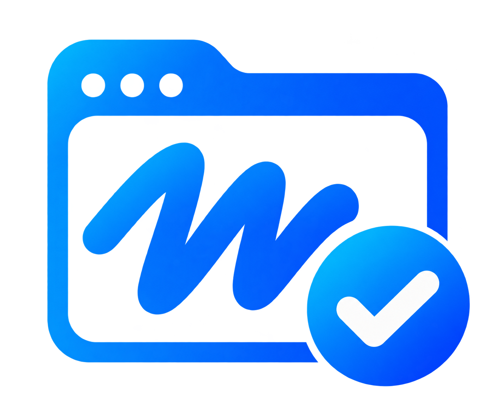

# Auto Approve for Muse

English | [简体中文](README.zh-CN.md)

A Chrome extension that approves [Muse](https://muse.ai) approval requests automatically, through the connection the signed-in Muse page already has. It does not click buttons, open menus or need the Approvals panel open. It is off until you turn it on.

> **Not affiliated with Muse.** This project relies on Muse's private web-client protocol, which can change at any time, and automating approvals may be against Muse's terms. Automatic approval removes a safety check that exists for a reason. Read [What it approves](#what-it-approves) before enabling it, and use it at your own risk.

## Install

1. Download `muse-auto-approve-<version>.zip` from [Releases](../../releases) and unzip it, or clone this repository and use its `extension` directory.
2. Open `chrome://extensions` and turn on **Developer mode**.
3. Click **Load unpacked** and choose the unzipped folder (or `extension`).
4. Open a Muse conversation and wait until it is connected.
5. Open the extension, click **Check connection (read-only)**, choose a scope and turn on **Auto-approve**. You are asked to accept the risk every time you turn it on.

No build step and no dependencies.

Releases also include a signed `.crx`. On Windows and macOS, Chrome only installs `.crx` files from outside the Chrome Web Store through [enterprise policy](https://support.google.com/chrome/a/answer/7532015); for personal use, load the ZIP unpacked as above.

## What it approves

- **Network connections only** (default): requests whose type is `network`.
- **All supported types**: also connectors, devices, browser actions, browser task confirmations, outgoing media, and three kinds of checkout. This can approve payments and sending content on your behalf. Only network requests have been tested against the live service.

For each request it picks the long-term grant the server itself offers, with the server's own scope (for example "always allow this site"). If there is none it allows once. It never invents or widens a scope, and never approves a request type it does not know.

Long-term grants stay in effect after you turn the extension off; revoke them in Muse.

## How it behaves

- Approvals are handled as they arrive: the page's own push events wake the extension. A 3-second timer in the page and a 30-second background scan are fallbacks.
- Every eligible request is handled in one pass, up to 20 at a time. The switch is re-read before each one, so turning it off takes effect immediately.
- Only you turn it off. A failed or unconfirmed approval is shown in the popup and retried after 60 seconds.
- While it is on, Muse tabs are protected from Chrome's memory saver. If Chrome already unloaded every Muse tab, the most recent one is reloaded.
- The popup shows the last result and when the last automatic check ran; it warns if checks stopped.
- The interface is in English and Simplified Chinese. It follows the browser language, or pick one at the top of the popup.

It needs a signed-in Muse conversation tab to stay open. It does nothing while that page is closed or frozen, the computer sleeps, or the sign-in expires.

## Privacy and permissions

| Permission | Why |
| --- | --- |
| `https://muse.ai/*` | Run in Muse pages. |
| `scripting` | Call Muse's approval methods inside the page. |
| `storage` | Keep your settings and the last result. |
| `alarms` | The 30-second fallback scan. |

The extension reads no conversation content and sends nothing anywhere except the approval decisions to Muse through Muse's own connection. It never reads cookies, tokens or keys. It stores only your settings, your language, and the time and code of the last result.

## Documentation

- [Architecture](docs/architecture.md): components, invariants, testing.
- [Protocol notes](docs/protocol.md): the Muse methods and events the extension uses.
- [Contributing](CONTRIBUTING.md) and [security policy](SECURITY.md).

## Development

```sh
npm run check   # syntax, JSON and whitespace
npm test        # 100% line, branch and function coverage required
npm run package # dist/*.zip, and a signed .crx when CRX_PRIVATE_KEY or --key is given
```

Requires Node.js 22.8 or later. There are no dependencies to install.

## License

[MIT](LICENSE)
